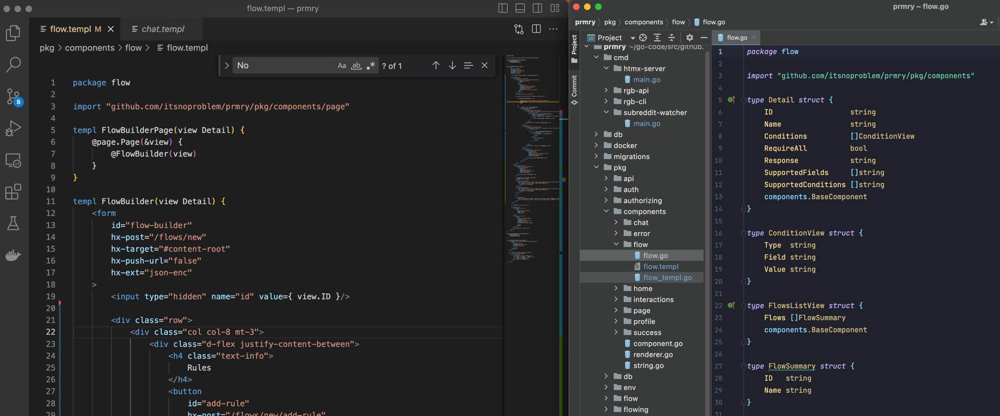

# RGB

Response Generator Bot.

- Manage, organize and share AI interactions
- engineer prompts with prompt generation rules
- integrate input / output targets like:
  - reddit
  - facebook
  - twitter / mastadon
  - slack / discord

## Table of Contents

- [Running](#Running)
- [Design](#Design)
- [Resources](#Resources)

## Running the app
The included Makefile provides 3 commands:

1) Compile the HTMX server into an executable `./server`
```sh
make build
```

2) Compile and run the HTMX server:
```sh 
make run
```

3) **To ease template development**, *make watch* uses [Reflex](https://github.com/cespare/reflex) 
to watch for changes to `pkg/templates/*.gohtml and reload the server when a template changes.
To use it, install reflex:

```sh
go install https://github.com/cespare/reflex@latest
```
then run:
```sh  
make build
make watch
```


#  Design
This application renders HTML markup server-side, using the [Templ templating language](https://templ.guide/) to define components which are roughly similar to react components, but written in Go. Interactivity and SPA behavior is achieved with HTMX, an extension to HTML that extends its capability via `hx-*` attributes, which allow behavior to be defined in the HTML markup.  For example to trigger a `GET` request from a button click, a button element could be defined like so: 
```html
<button hx-get="/do-something" hx-trigger="click">
  Do Something
</button>
```

More about the hypertext-focused design in the [References](#references) below.

### Resources
A **resource** defines the http resource that drives the application.  For example the URL `/profile` is resolved by the 
**profiling** resource, which mounts a route for the http method `GET` and url path `/profile`.

### Components
Components live in the `components` package, and are defined by 3 files:
* **domain.go** - contains view model structs, which are used to pass data to a template. Each view model must implement `htmx.BaseComponent` 
* **domain.templ** - contains template definitions. 
* **domain_templ.go** - contains go code generated by the `templ generate` command.

Resources define interfaces for a **Renderer** and a **Service**, ultimately calling `renderer.RenderTemplComponent()`. This render function accepts parameters for a _page_ component, representing a full-page render from `<html>` to `</html>`, and a _fragment_ component representing only the HTML needed to respond to an HTMX-initiated request.  

### Putting it together:

The view model for a profile page is defined in **profile.go**:
```
type ProfileView struct {
  ID    string
  Name  string
}
```

The components are defined in **profile.templ**.  Templ allows us to compose templates, so for the full page component, the _Profile_ component is composed inside the _Page_ component (defined in html.templ):
````
templ Profile(view ProfileView) {
  <div>
    Hello { view.Name }, your id is { view.ID }.
  </div>
}

templ ProfilePage(view ProfileView) {
  @Page(&view) {
    @Profile(view)
  }
}
```

---



---

### Reference

- [HTMX](https://htmx.org/docs/)
- [Locality of Behavior (LoB)](https://htmx.org/essays/locality-of-behaviour/)
- [Islands Architecture](https://github.com/bensmithett/tropical-utils/tree/main/packages/tropical-islands) / [discussion](https://www.patterns.dev/posts/islands-architecture)
- [HATEOAS](https://htmx.org/essays/hateoas/)

## Contributing
Please contribute using [Github Flow](https://guides.github.com/introduction/flow/). Create a branch, add commits, and [open a pull request](https://github.com/fraction/readme-boilerplate/compare/).
