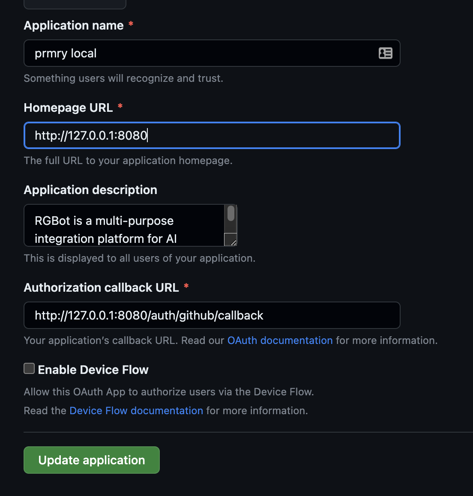
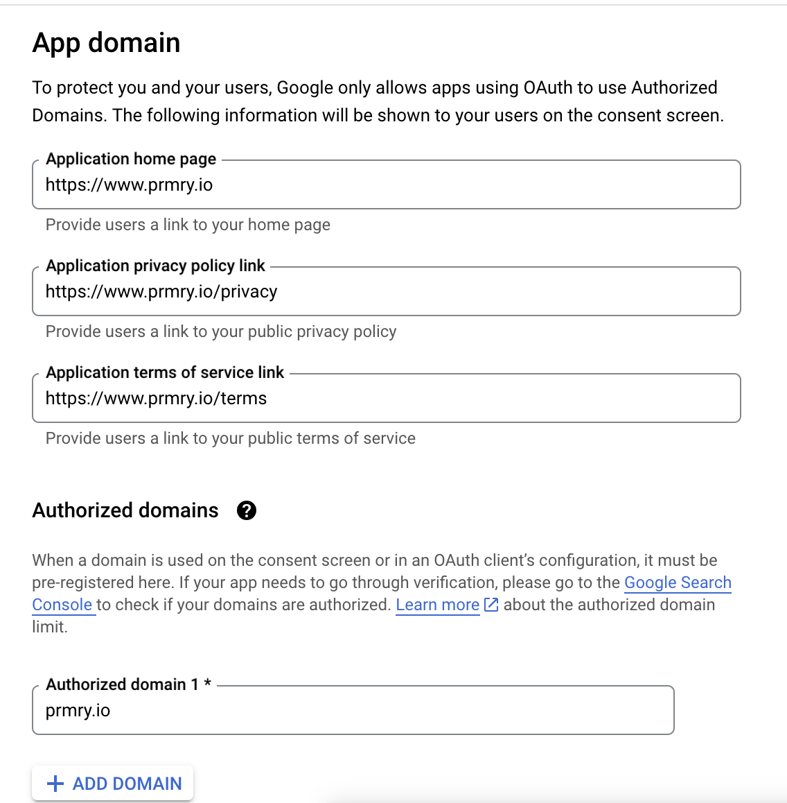

# Getting Oauth Client Credentials

### Github

---
1. Login to Github and click on your **profile picture** in the main menu and choose **settings**,
   then **Developer Settings** (bottom of the menu on the left)
   

2. Click [Oauth Apps](https://github.com/settings/developers) and create a new app. 
   Configure the homepage and callback urls, and make sure these align with
   the `APP_URL` defined in your _.env_ file.
   

3. Click the "Generate a new client secret" and copy the credentials 
   to your _.env_ file.
 
   
### Google

---
1. Login to [Google Cloud console](https://console.cloud.google.com/) and, using the 
   project selector at the top, create a new project. Once the project is
   done creating, select the project.

2. Click on **API's and Services** and the **OAuth Consent Screen** in the menu on the left.

3. As with Github, configure according to `APP_URL`, save and continue.
   

4. Finish configuring the app (it only needs the _email_ scope).
   Create credentials and add them to your _.env_ file. 
